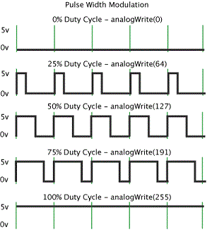

class: center, middle

# SOEN 422
## Tutorial 1

---

# Agenda

1. Introduction

2. Installing Arduino IDE and Teensyduino

3. Basics of Arduino Programming (What you need to know for Lab 1...)

---

# Introduction

* My name is Patrick

* Best way to contact me is at patrick.ayoup@gmail.com

  * I usually reply very quickly to emails.

* Final Year Student in Software Engineering

* This course is really fun!

---

# Installing Arduino IDE and Teensyduino

* Download and install the [Arduino IDE](http://www.arduino.cc/en/Main/Software) for your operating system. The current latest version is 1.0.5.

  * The Arduino IDE is written in Java. You may need to install the [JRE](http://www.oracle.com/technetwork/java/javase/downloads/jre8-downloads-2133155.html) if it is not already installed on your workstation.

  * Installation instructions are found [here](http://arduino.cc/en/Guide/HomePage)

* Teensy is an Arduino Compatible development board. Since it is not manufactured by Arduino, some middleware is necessary for loading code onto the device.

* Download and install [Teensyduino](https://www.pjrc.com/teensy/td_download.html) for your operating system.

* Verify that your development environment works by following the instructions on the [Teensy website](https://www.pjrc.com/teensy/tutorial.html) for loading and running the "Blink" program.

---

# Introduction to Arduino

* Arduino programs (called sketches) are written in C or C++.

* The Arduino platform is set of high level C++ libraries used to abstract the details of programming microcontrollers.

* Additionally, a small framework is provided to manage the control flow of the sketch execution.

---

# Anatomy of an Arduino Sketch

* A sketch is structured into two functions: ``setup()`` and ``loop()``.

* At the beginning of the sketch's execution, the ``setup()`` function is called once.

  * This is an ideal place to put initialization code.

```c++
void setup() {                
  pinMode(led, OUTPUT);     
}
```

* After calling the ``setup()`` function, the ``loop()`` function is executed as the body of an infinite loop.

```c++
void loop() {
  digitalWrite(led, HIGH);
  delay(1000);
  digitalWrite(led, LOW);
  delay(1000);
}
```

---

# Anatomy of an Arduino Sketch

* Finally, constants, variables, and helper functions should be declared at the top of the sketch.

```c++
/*
  Blink
  Turns on an LED on for one second, then off for one second, repeatedly.
 
  This example code is in the public domain.
 */
 
int led = 13; // or #define led 13

void setup() {                
  pinMode(led, OUTPUT);     
}

void loop() {
  digitalWrite(led, HIGH);
  delay(1000);
  digitalWrite(led, LOW);
  delay(1000);
}
```

---

# Digital Output

* To output a digital signal on a pin, that pin's mode must be set to ``OUTPUT`` using the ``pinMode()`` function.

* To set a pin to ``HIGH`` or ``LOW``, use the ``digitalWrite()`` function.

```c++
int MY_PIN = 13;

// Set pin 13 to output mode and output a HIGH signal through that pin.
pinMode(MY_PIN, OUTPUT);

digitalWrite(MY_PIN, HIGH);
```

---

# Digital Input

* To read a digital signal on a pin, that pin's mode must be set to either ``INPUT`` or ``INPUT_PULLUP``.

  * When set to ``INPUT``, if no source is connected to the pin, the state will be uncertain and could be read as either ``HIGH`` or ``LOW``.

  * When set to ``INPUT_PULLUP``, if no source is connected to the pin, the state is "pulled-up" to a ``HIGH`` state due to an internal pull up resistor in the microcontroller.

* The state of a pin is read using the ``digitalRead()`` function.

```c++
int MY_PIN = 13;

pinMode(MY_PIN, INPUT);

// If MY_PIN is HIGH, DO X, otherwise DO Y.
if (digitalRead(MY_PIN)) {
  doX();
} else {
  doY();
}
```

---

# Analog Output

* To output an analog signal on a pin, pulse width modulation (PWM) is used.
  
  * PWM is a technique for getting an analog signal.

  * A square wave is generated by rapidly switching a pin between 0V and 5V.



---

# Analog Output

* The fraction of a given time interval where the pin is set to 5V is called the duty cycle.
  
  * Ex. If the signal is high for 25% of the interval and low for 75% of the interval, the duty cycle is 25% and a voltage of 1.25V should be read (0.75 * 5 = 1.25).

* To achive this in Arduino code, the ``analogWrite()`` function is used.
  
  * This function takes two parameters, the pin to write to and the duty cycle which is a value between 0 and 255.

  * For a 50% duty cycle, we provide 256 / 2 = 128.

* NOTE: Not all pins support PWM, you must verify on your pinout charts to find those which do.

```c++
int MY_PIN = 6;

// Set pin 6 to output mode and output a PWM with 25% duty cycle.
pinMode(MY_PIN, OUTPUT);

analogWrite(MY_PIN, 64);
```

---

# References

* [Arduino Reference](http://arduino.cc/en/Reference/HomePage)

* [INPUT vs INPUT_PULLUP](http://electronics.stackexchange.com/questions/67007/whats-the-difference-between-input-and-input-pullup)

* [Pull-Up Resistors](https://learn.sparkfun.com/tutorials/pull-up-resistors)

* [PWM](http://arduino.cc/en/Tutorial/PWM)

* [PWM Video](https://www.youtube.com/watch?v=Y1QraI5i_XM)

---

# Copyrights

* PWM image on Slide 10 is provided by [Timothy Hirzel](http://arduino.cc/en/Tutorial/PWM).

<a rel="license" href="http://creativecommons.org/licenses/by-sa/4.0/"></a><br />This work is licensed under a <a rel="license" href="http://creativecommons.org/licenses/by-sa/4.0/">Creative Commons Attribution-ShareAlike 4.0 International License</a>.