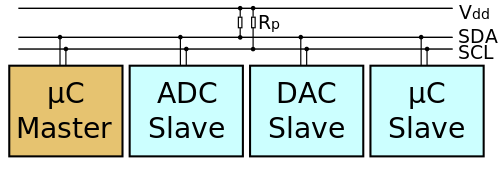

class: center, middle

# SOEN 422
## Tutorial 5

---

# I2C Background

* I2C (**I**nter **I**ntegrated **C**ircuit) is a networking protocol for communicating between integrated circuits.

* I2C operates on a two wire bus and allows communication between many devices (up to 128 devices on two wires) without occupying many MCU pins.



---

# I2C Background

* Both wires are pulled up when idle by pull up resistors on each line.

  * **NOTE**: The pull up resistors are not necessary with the Adafruit level shifters as they have built in 10KOhm resistors on each channel.

* All I2C devices are given a unique address (a 7 bit integer).

  * This address is used to identify which devices are involved in a communication transaction.

* An I2C device can assume one of two roles: **Slave** or **Master**.

  * Both roles are capable of sending and receiving data. It is the responsibility of the master device to initiate and terminate a communication transaction.

  * When working with the Beaglebone Black and the Teensy++ 2.0, it is most likely that the Beaglebone will be used as a master and the Teensy will be used as a slave.

---

# I2C Protocol (Master Sender)

* Send a start sequence to notify all slaves that you wish to send a message. All slaves start listening.

  * Start Sequence: When SCL is high (bus idle), pull SDA down. This results in the clock pulse starting on SCL.

* Send the 7 bit device address of the slave you wish to write to. When a slave recognizes its own address, it will continue listening, all other slaves ignore the rest of the transaction.

  * Bits 1-7 are used for the address, bit 0 is set to 0 indicating write mode.

* The slave responds with an ACK bit.

* Send a data byte.

* The slave responds with an ACK bit.

---

# I2C Protocol (Master Sender)

* Send more databytes (and wait for an ACK bit each time), or send a stop sequence to notify the end of the transaction and release the bus.

  * Stop Sequence: Release SCL and let the resistor pull it high followed by the SDA line.

---

# I2C Protocol (Master Receiver)

* Send a start sequence to notify all slaves that you wish to send a message. All slaves start listening.

* Send the 7 bit device address of the slave you wish to write to.

  * Bits 1-7 are used for the address, bit 0 is set to 1 indicating read mode.

* The slave responds with an ACK bit.

* The slave sends a data byte.

* The master responds with an ACK bit if they wish to continue reading. If they wish to stop reading, the master sends a stop sequence.

* The slave sends more data bytes if requested (and wait for an ACK bit from the master each time).

---

# I2C Master Sender on Beaglebone Black

* For programming the Beaglebone Black as an I2C Master Sender, we will use C.

* On the Beaglebone Black, there are 2 I2C busses. Since the ``I2C2`` bus is used by the system at startup, it is easier to start with ``I2C1``.

* The I2C busses are located in the following files:

  * /dev/i2c-1
  * /dev/i2c-2

* The following libraries will be required for working with I2C.

```C
#include <stdio.h>
#include <fcntl.h>
#include <unistd.h>
#include <linux/i2c.h>
#include <linux/i2c-dev.h>
#include <string.h>
```

---

# I2C Master Sender on Beaglebone Black

* First, we must open the bus:

```C
// Open the bus in read/write mode.
// If the returned value is < 0, there was an error.
int i2cBus1 = open("/dev/i2c-1", O_RDWR);
```

* Next, we must send the slave device address to inform the required device that we wish to communicate with it:

```C
int slaveAddress = 0x7;

// Initiate the handshake with the slave.
// If the returned value is < 0, there was an error.
ioctl(i2cBus1, I2C_SLAVE, slaveAddress);
```

---

# I2C Master Sender on Beaglebone Black

* Finally, we may send bytes to the slave:

```C
char message[] = "hello world";

// Send the message. Returns the number of bytes sent.
write(i2cBus1, message, strlen(message));
```

---

# I2C Master Sender on Beaglebone Black

* I2C is also accessable from Python and Bonescript:

  * [Python Documentation](https://learn.adafruit.com/setting-up-io-python-library-on-beaglebone-black/i2c)

  * [Bonescript Documentation](https://github.com/jadonk/bonescript#i2c)

---

# I2C Slave Receiver on Teeny++ 2.0

* For programming the Teensy as an I2C slave, we will use the Arduino platform's ``Wire`` library.

* The ``Wire`` library will be required for working with I2C.

```C
#include <Wire.h>
```

---

# I2C Slave Receiver on Teeny++ 2.0

* First, we must register the Teensy's device address:

```C
int SLAVE_ADDRESS = 0x7;
Wire.begin(SLAVE_ADDRESS);
```

* Next, we must register an event handler method for receiving packets over I2C. This callback function takes the number of bytes received as an argument.

```C
Wire.onReceive(myCallbackFunction);
```

* Finally, we can read a byte from I2C using the ``read()`` method.

```C
char myChar = Wire.read();
```

---

# References

* [I2C Specification](http://i2c.info/i2c-bus-specification)

* [Python I2C](https://learn.adafruit.com/setting-up-io-python-library-on-beaglebone-black/i2c)

* [Bonescript I2C](https://github.com/jadonk/bonescript#i2c)

---

# Copyrights

* I2C Diagram on slide 2 is provided by [Colin M.L. Burnett](http://commons.wikimedia.org/wiki/File:I2C.svg).

<a rel="license" href="http://creativecommons.org/licenses/by-sa/4.0/"></a><br />This work is licensed under a <a rel="license" href="http://creativecommons.org/licenses/by-sa/4.0/">Creative Commons Attribution-ShareAlike 4.0 International License</a>.